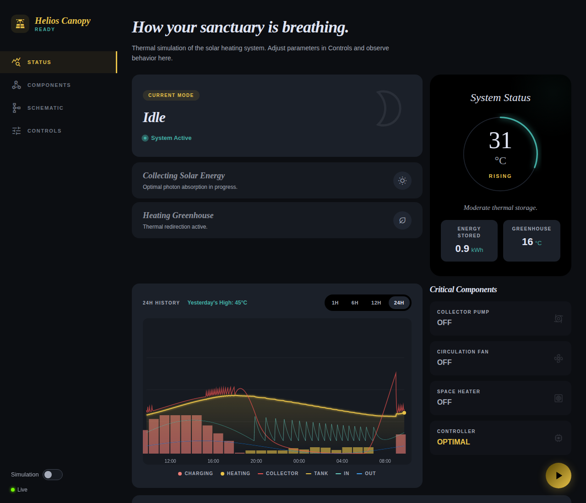

# Greenhouse Solar Heating System

Solar thermal heating system for a greenhouse in Southwest Finland.

## What This Is

A green house heating solar thermal system that:
- Heats water in an instulated tank using solar collectors
- Distributes stored heat to the greenhouse with a water-to-air heat exchanger
- Uses active pump-driven drainback for freeze protection (spring/autumn nightly drain cycles)
- Controlled by Shelly devices with temperature sensors

## Interactive Playground

**[Try it live →](https://wnt.github.io/greenhouse-solar-heater/)**

A hash-routed SPA/PWA deployed via GitHub Pages. In simulator mode it runs entirely client-side, loading `system.yaml` as configuration and re-using the on-device control logic verbatim.

| View | Description |
|------|-------------|
| [`#status`](playground/index.html#status) | Live readings, current operating mode, and energy balance |
| [`#components`](playground/index.html#components) | System topology with valve/pump state overlaid |
| [`#controls`](playground/index.html#controls) | Manual mode override and 24 h simulation controls |
| [`#device`](playground/index.html#device) | Sensor discovery, role assignment, and Shelly device config |
| [`#settings`](playground/index.html#settings) | Notifications, data source, and account management |

## Project Files

| File | Purpose |
|------|---------|
| `system.yaml` | **Source of truth** — all component specs, heights, valve states, operating modes |
| `shelly/` | Shelly control software — control logic, telemetry, deploy script, platform linter |
| `playground/` | SPA/PWA — status, components, controls, device, settings views |
| `server/` | Node.js API — HTTP + WebSocket + MQTT bridge + WebAuthn auth + history (PostgreSQL/TimescaleDB) |
| `deploy/` | Cloud deployment — Terraform (UpCloud K8s + Postgres + S3), Docker, OpenVPN sidecar, K8s manifests |
| `design/docs/` | Design documentation — architecture, modes, safety rules, BOM |
| `design/diagrams/` | SVG schematics + Mermaid state/sequence diagrams |
| `design/construction/` | Physical build instructions |
| `design/photos/` | Photos of owned components (pump, panels, tank) |
| `tests/` | Unit tests, thermal simulation scenarios, frontend Playwright, and e2e tests |

## Documentation Format

- **YAML** (`system.yaml`) — machine-readable source of truth. AI agents validate this.
- **Mermaid** (`.mmd`) — control logic, state machines, sequences
- **SVG** (`.svg`) — physical layout with height coordinates and `data-` attributes

## Key Design Decisions

- **Unpressurized system** — Jäspi tank sealed but vented via a 25 L plastic canister (loose cap, 3× 22 mm PEX bottom fittings) on the dip-tube port
- **On/off valve manifold** — 7 motorized on/off DN15 valves (3 input, 3 output, plus V_air) around a single pump
- **Active drainback** — pump empties collectors; air enters via V_air at collector top
- **Pump power monitoring** — fixed-duration drain run; no physical flow sensor
- **Canister reservoir** — primary air separator; trapped air from collector loop and tank vents through the loose cap
- **Manual service valves** — SV-drain and SV-fill for system maintenance
- **Shelly control** — Pro 4PM (main) + Pro 2PM × valves + Shelly 1 Gen3 with Add-on (sensors)
