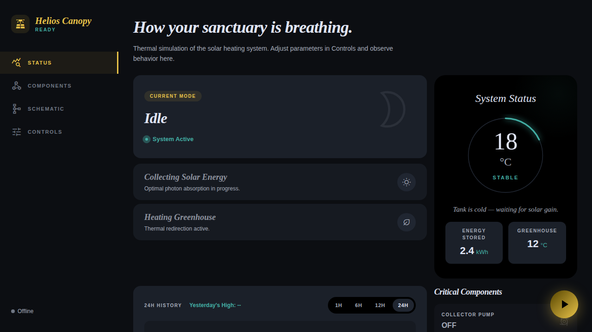
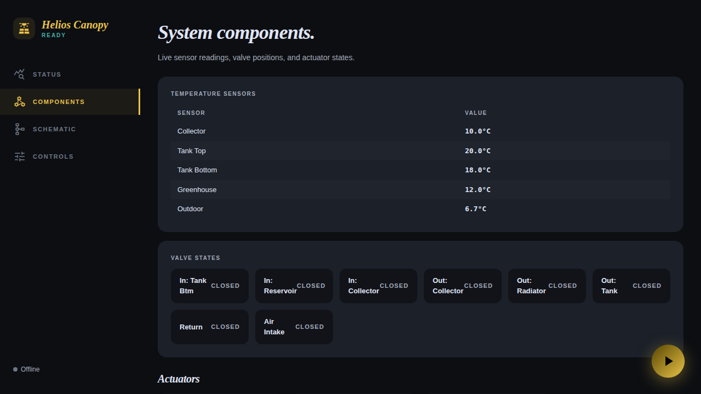
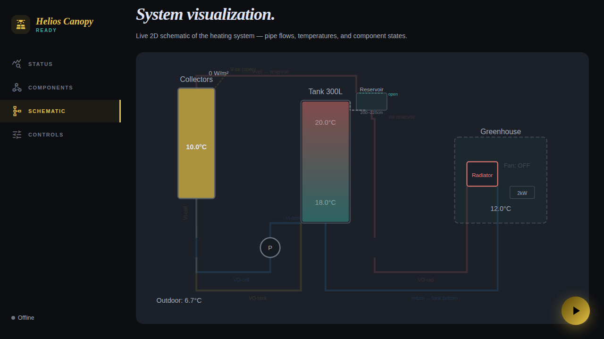
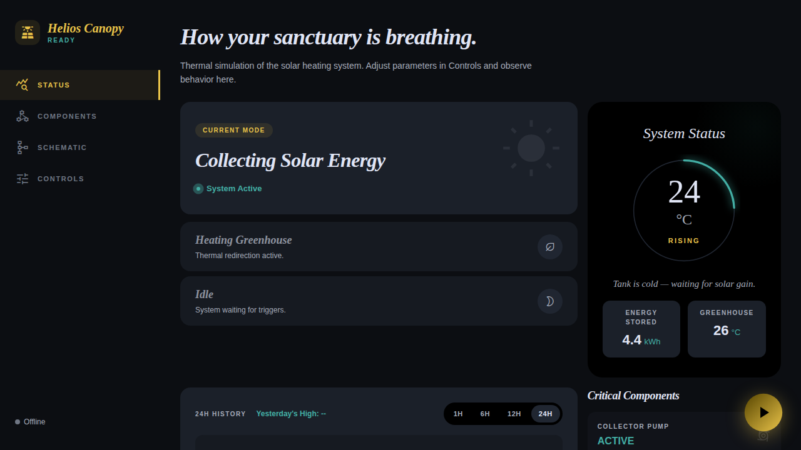
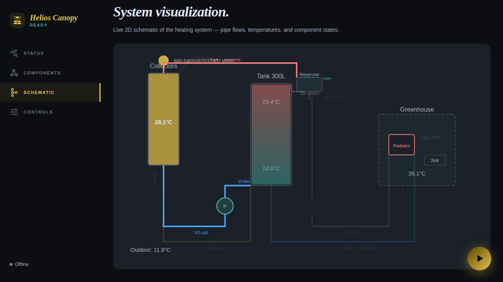
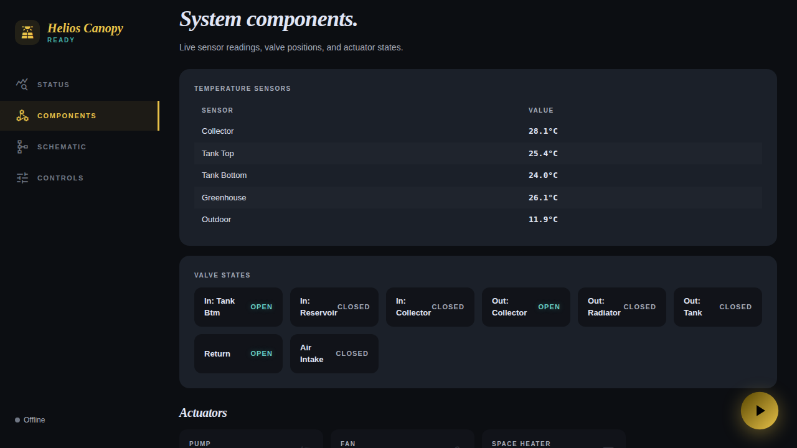
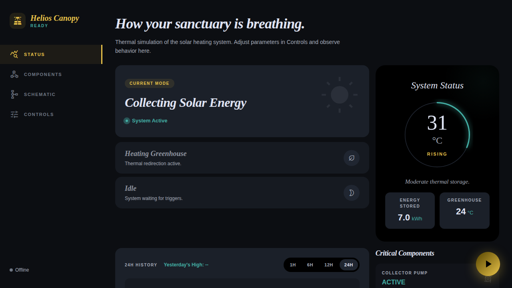
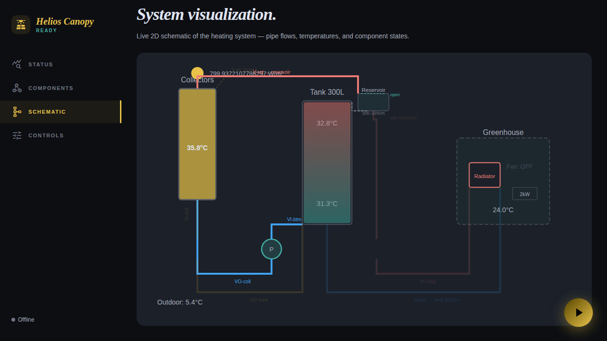
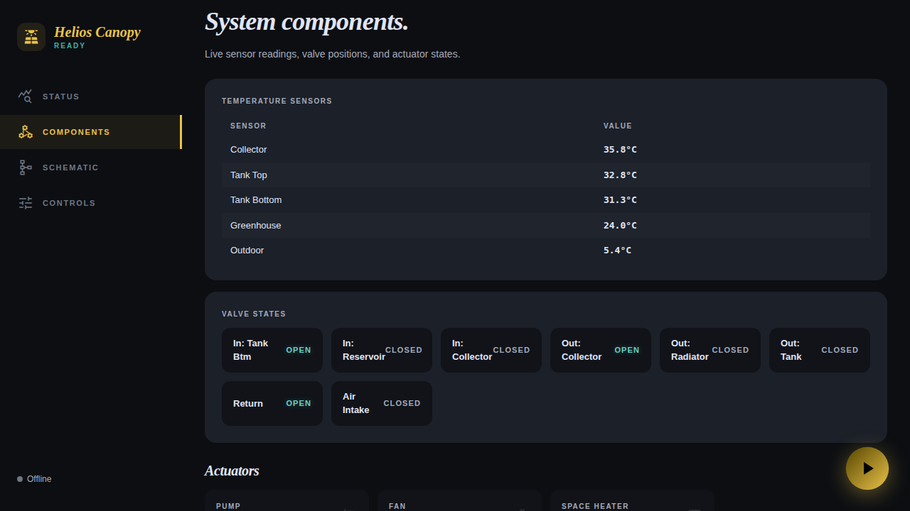

# Staged Commissioning Guide

**Feature**: 017-review-hardware-architecture  
**Date**: 2026-04-02

This guide describes how to bring the greenhouse solar heating control system online incrementally as hardware installation progresses. You enable individual loops as hardware is installed, with hard safety rules (freeze/overheat drain) always active from the first power-on.

## Overview Flowchart

The commissioning process follows four phases. See the full Mermaid diagram at [`design/diagrams/commissioning-flow.mmd`](../diagrams/commissioning-flow.mmd).

```
┌─────────────────┐     ┌──────────────────┐     ┌─────────────────┐     ┌──────────────────┐
│  Phase 1        │     │  Phase 2         │     │  Phase 3        │     │  Phase 4         │
│  Install        │────▶│  Verify          │────▶│  Solar Loop     │────▶│  Add Loops       │
│  Control Box    │     │  Sensors         │     │  (Stage 1)      │     │  Progressively   │
│                 │     │                  │     │                 │     │                  │
│  • Pro 4PM      │     │  • Read sensors  │     │  • ce=true      │     │  • Add GH loop   │
│  • 3 sensors    │     │  • Warm/cool     │     │  • ea=3 (V+P)   │     │  • Add EH mode   │
│  • Pro 2PMs     │     │    each probe    │     │  • am=["SC"]    │     │  • am=null (all)  │
│  • 24V PSU      │     │  • Confirm IDs   │     │  • Test freeze  │     │  • ea=31 (all)    │
│  • Ethernet     │     │                  │     │  • Autonomous    │     │  • Full auto      │
└─────────────────┘     └──────────────────┘     └─────────────────┘     └──────────────────┘
                                                         │
                                                    Safety drains
                                                  ALWAYS active ⚡
```

> **Safety guarantee**: Freeze drain (outdoor < 2°C) and overheat drain (tank > 85°C) fire automatically at every stage, regardless of device config settings. They cannot be disabled.

## Prerequisites

Before starting commissioning:

- [ ] Shelly Pro 4PM flashed with latest scripts via `shelly/deploy.sh`
- [ ] Ethernet switch installed and all Pro devices connected
- [ ] 24V DC PSU wired to all valve actuators
- [ ] Shelly 1 Gen3 + Add-on connected with 3 DS18B20 sensors
- [ ] Router configured with DHCP reservations matching `shelly/devices.conf`

---

## Phase 1: Install Control Box

### Hardware Checklist

| Component | IP Address | Purpose |
|-----------|------------|---------|
| Shelly Pro 4PM | 192.168.1.174 | Controller — runs control logic, drives pump |
| Shelly Pro 2PM #1 | 192.168.1.11 | Valves VI-btm, VI-top (input manifold) |
| Shelly Pro 2PM #2 | 192.168.1.12 | Valves VI-coll, VO-coll (collector loop) |
| Shelly Pro 2PM #4 | 192.168.1.14 | Valves V_ret, V_air (collector top) |
| Shelly 1 Gen3 + Add-on | 192.168.1.86 | Sensor hub — 3× DS18B20 |
| Zyxel GS-108BV5 | — | 8-port Ethernet switch |
| Mean Well 24V 15W PSU | — | Powers all valve actuators |

### Step 1.1: Deploy Scripts

```bash
cd shelly/
./deploy.sh
```

This flashes `control-logic.js` + `control.js` to the Pro 4PM (script slot 1) and `telemetry.js` (slot 3).

### Step 1.2: Initial Boot (Controls Disabled)

The system boots with controls disabled by default (`ce: false`). Push this initial config via the Device view in the playground UI or via MQTT:

```json
{ "ce": false, "ea": 0, "fm": null, "am": null, "v": 1 }
```

At this point:
- The system monitors all sensor temperatures
- No valves or actuators are commanded
- **Safety drains are still active** — if outdoor drops below 2°C, the system WILL drain the collectors even with `ce: false`

### Step 1.3: Verify Communication

Open the playground UI (connect to your server or use the live mode toggle). Navigate to **Status** view.


*Status view after first boot. The mode shows "Idle", and sensor readings populate in the gauge and cards. All sensors should show plausible temperatures.*

Navigate to **Components** view to see individual sensor readings and valve states:


*Components view showing all temperature sensors with current readings, all valves CLOSED, and all actuators OFF.*

Navigate to **Schematic** view to see the system topology:


*Schematic view showing the physical layout. All pipe flow paths are dimmed (inactive). The pump circle shows no activity. Temperatures are displayed at each component.*

---

## Phase 2: Sensor Identity Verification

**Why this matters**: DS18B20 sensors on the 1-Wire bus are identified by index (0-4), not by physical label. A miswired sensor — say the outdoor sensor probe is actually reading collector temperature — could prevent freeze drain from triggering, or trigger it falsely. **You must verify each sensor identity before enabling automatic modes.**

### Step 2.1: Read Current Sensor Values

With the system booted (`ce: false`), open the playground UI → **Components** view. You should see 3 temperature readings:

| Sensor Name | Expected Location | Expected Range |
|-------------|-------------------|----------------|
| Collector | Collector outlet (280cm height) | Ambient or sun-warmed |
| Tank Bottom | Tank lower region (~10cm) | Water temperature |
| Outdoor | Outside, shaded | Outside air temperature |

### Step 2.2: Physical Verification (One Sensor at a Time)

For each of the 3 sensors:

1. **Locate the physical probe** on the 1-Wire bus
2. **Apply heat** — grip the probe firmly with your hand (body heat is enough for a 2-3°C rise), or use a heat gun / warm water
3. **Watch the playground UI** — the Components view updates every 30 seconds. One reading should rise noticeably
4. **Confirm the correct reading changed**:
   - If you warmed the probe at the collector outlet and the "Collector" reading rose → correct
   - If a different reading rose → the sensor wires are swapped

### Step 2.3: Fix Miswiring

If sensors are swapped:
- **Option A**: Physically swap the sensor probes to the correct locations
- **Option B**: Swap the sensor IDs in `control.js` → `SENSOR_IDS` map → redeploy

### Step 2.4: Freeze Trigger Test

Use ice wrapped in cloth on the **outdoor sensor** probe:
1. Watch the outdoor temperature reading drop toward 2°C
2. When it drops below 2°C, the system should automatically enter **Active Drain** mode
3. Verify mode change in the Status view (mode badge changes to "Active Drain")
4. Remove the ice — outdoor reading recovers, system returns to Idle

> **Note**: This test fires even with `ce: false` because freeze drain is a hard safety override.

### Step 2.5: Record Verified Mapping

| Wire Label | Physical Location | Logical Name | Sensor ID | Verified |
|------------|-------------------|--------------|-----------|----------|
| __________ | Collector outlet | collector | 0 | ☐ |
| __________ | Tank lower region | tank_bottom | 2 | ☐ |
| __________ | Outside, shaded | outdoor | 4 | ☐ |

---

## Phase 3: Enable Solar Collector Loop (Stage 1)

### Step 3.1: Set Device Config

Push this config via the playground Device view or MQTT:

```json
{ "ce": true, "ea": 3, "fm": null, "am": ["SC"], "v": 2 }
```

| Field | Value | Meaning |
|-------|-------|---------|
| `ce` | `true` | Controls enabled — system can actuate valves and pump |
| `ea` | `3` | Enabled actuators: valves (bit 0 = 1) + pump (bit 1 = 2) |
| `am` | `["SC"]` | Only Solar Charging mode allowed. Safety drains always bypass this filter. |

### Step 3.2: Verify Solar Charging

Wait for sunny conditions (collector temperature rises above tank bottom + 7°C). The system should automatically enter Solar Charging mode.


*Status view during Solar Charging. The mode badge shows "Collecting Solar Energy" with a system active indicator. The tank gauge shows stored energy rising.*

The **Schematic** view shows the active flow path:


*Schematic during solar charging. The solar collector pipes are highlighted, showing water flow from tank bottom → pump → collectors → reservoir → tank top. The pump circle pulses to show it is running.*

The **Components** view confirms which valves are open:


*Components view during solar charging. Valves VI-btm, VO-coll, and V_ret show OPEN. All other valves are CLOSED. The pump shows ACTIVE.*

### Step 3.3: Manual Freeze Drain Test

Even if outdoor temperature is well above 2°C, you can manually trigger a drain to verify the full sequence:

1. Push forced mode config:
   ```json
   { "ce": true, "ea": 3, "fm": "AD", "am": ["SC"], "v": 3 }
   ```

2. The system immediately enters Active Drain mode. Watch the transition:

   
   *Status view during Active Drain (freeze protection). The mode is shown as active with drain-specific indicators.*

   The schematic shows the drain flow path:

   
   *Schematic during Active Drain. The drain pipes are highlighted: V_air opens at collector top (air intake), pump draws water from collector bottom (VI-coll) and pushes to tank (VO-tank).*

   The components view confirms the drain valve configuration:

   
   *Components view during Active Drain. Valves VI-coll, VO-tank, and V_air show OPEN. Pump is ACTIVE. All other valves are CLOSED.*

3. The drain sequence runs until:
   - Pump power drops below 20W for 3 consecutive readings (600ms) → dry-run detected → pump stops
   - Or 180-second timeout → pump stops

4. Clear forced mode:
   ```json
   { "ce": true, "ea": 3, "fm": null, "am": ["SC"], "v": 4 }
   ```

### Step 3.4: Stage 1 Validation Checklist

- [ ] All 3 sensors reading plausible temperatures (Components view)
- [ ] Solar charging activates automatically when collector is hot (collector > tank_bottom + 7°C)
- [ ] Solar charging stops when delta drops below 3°C
- [ ] Freeze drain fires automatically when outdoor < 2°C
- [ ] Manual drain test (`fm: "AD"`) executes full sequence
- [ ] Pump dry-run detection stops drain correctly (power monitoring)
- [ ] Collectors marked as drained after drain completes
- [ ] System returns to Idle after drain, resumes solar when conditions are met

**Stage 1 is now operational.** The solar collector loop runs autonomously with freeze protection. No other modes can activate (greenhouse heating, emergency heating are filtered by `am`).

---

## Phase 4: Progressive Enablement

As you install additional hardware (radiator loop, space heater), progressively enable modes. At each step: verify new sensors, test the new mode manually via forced mode, then add it to the allowed modes list.

### Add Greenhouse Heating

**When**: Radiator + fan installed in greenhouse, tank top sensor and greenhouse sensor connected.

**New hardware**:
- Pro 2PM unit 3 (192.168.1.13) — valves VO-rad, VO-tank
- Tank top sensor (sensor ID 1) and greenhouse sensor (sensor ID 3)
- 230V fan connected to Pro 4PM O2

**Sensor verification**: Repeat Phase 2 for the 2 new sensors (tank_top, greenhouse). Warm each probe and verify the correct reading changes in Components view.

**Config update**:

```json
{ "ce": true, "ea": 7, "fm": null, "am": ["SC", "GH"], "v": 5 }
```

| Change | Old → New | Meaning |
|--------|-----------|---------|
| `ea` | `3 → 7` | Added fan (bit 2 = 4): valves + pump + fan |
| `am` | `["SC"] → ["SC", "GH"]` | Added Greenhouse Heating mode |

**Test**: Set `fm: "GH"` to force greenhouse heating. Verify:
- Pump runs, fan runs
- Hot water flows through radiator (VI-top → pump → VO-rad → radiator → tank bottom)
- Greenhouse temperature begins to rise
- Clear `fm: null` when verified

**Validation**:
- [ ] Tank top and greenhouse sensors verified
- [ ] Forced greenhouse heating (`fm: "GH"`) operates pump + fan
- [ ] Radiator loop circulates (feel pipes warming)
- [ ] System auto-enters GH mode when greenhouse < 10°C and tank has useful heat

### Add Emergency Heating

**When**: 2kW space heater connected to Pro 4PM O4.

**Config update**:

```json
{ "ce": true, "ea": 15, "fm": null, "am": ["SC", "GH", "EH"], "v": 6 }
```

| Change | Old → New | Meaning |
|--------|-----------|---------|
| `ea` | `7 → 15` | Added space heater (bit 3 = 8) |
| `am` | `["SC", "GH"] → ["SC", "GH", "EH"]` | Added Emergency Heating mode |

**Test**: Set `fm: "EH"` to force emergency heating. Verify space heater activates (feel heat output). Clear `fm: null`.

### Full System

**When**: All hardware installed and each loop individually verified.

**Config update**:

```json
{ "ce": true, "ea": 31, "fm": null, "am": null, "v": 7 }
```

| Change | Old → New | Meaning |
|--------|-----------|---------|
| `ea` | `15 → 31` | Added immersion heater (bit 4 = 16): all actuators enabled |
| `am` | `["SC", "GH", "EH"] → null` | All modes allowed (no filter) |

The system now operates fully autonomously. All modes can activate based on sensor conditions. Safety drains have been active since Phase 3.

---

## Device Config Quick Reference

### Actuator Bitmask (`ea`)

| Bit | Value | Actuator | Added at |
|-----|-------|----------|----------|
| 0 | 1 | Motorized valves | Stage 1 |
| 1 | 2 | Circulation pump | Stage 1 |
| 2 | 4 | Radiator fan | Greenhouse heating |
| 3 | 8 | Space heater (2kW) | Emergency heating |
| 4 | 16 | Immersion heater | Full system |

Common combinations: `3` (V+P), `7` (+fan), `15` (+heater), `31` (all).

### Mode Codes (`fm`, `am`)

| Code | Mode | Valves Open | Actuators |
|------|------|-------------|-----------|
| `I` | Idle | None | None |
| `SC` | Solar Charging | VI-btm, VO-coll, V_ret | Pump |
| `GH` | Greenhouse Heating | VI-top, VO-rad | Pump, Fan |
| `AD` | Active Drain | VI-coll, VO-tank, V_air | Pump |
| `EH` | Emergency Heating | None | Space heater, Immersion |

### Safety Rules (Always Active)

These fire regardless of `ce`, `ea`, or `am`:

| Rule | Trigger | Action |
|------|---------|--------|
| Freeze drain | outdoor < 2°C | Active Drain (empties collectors) |
| Overheat drain | tank_top > 85°C | Active Drain (prevents boiling) |
| Sensor staleness | Any sensor > 150s old | Idle (pump off, safe state) |

---

## Troubleshooting

### Sensor reading shows "--" or null

- Check physical connection of DS18B20 probe to Add-on
- Verify sensor hub IP (192.168.1.86) is reachable from Pro 4PM
- Check 1-Wire bus wiring (data, VCC, GND)

### Valve doesn't open

- Verify 24V PSU is powered and wired to valve actuators
- Check Pro 2PM unit IP is reachable from Pro 4PM
- Check valve relay assignment in `control.js` VALVES map
- Test directly: access Pro 2PM web UI → Switch → toggle relay

### Pump doesn't start

- Verify pump is connected to Pro 4PM O1 (id: 0)
- Check `ea` bitmask includes pump (bit 1 = 2)
- Check `ce: true` in device config
- For safety drains: pump starts even with `ce: false`

### Solar charging doesn't activate

- Check `am` includes `"SC"` (or is `null`)
- Verify collector temp > tank_bottom + 7°C (check Components view)
- If collectors are drained, system waits for speculative refill conditions
- Check `collectorsDrained` flag in system logs

### Freeze drain doesn't fire

- Verify outdoor sensor is correctly identified (Phase 2)
- Check outdoor reading is actually below 2°C (Components view)
- Safety drain bypasses `ce`, `ea`, `am` — if it still doesn't fire, check sensor hub connectivity
