# Control-logic decisions — three scenario walkthroughs

This document traces three specific paths through
[`shelly/control-logic.js`](../../shelly/control-logic.js) `evaluate()`:

1. **IDLE + collectors empty** → start charging via speculative refill
2. **IDLE + collectors filled** → start charging via normal entry
3. **SOLAR_CHARGING** → leave (to IDLE, or via safety drain)

Each scenario lists the exact checks `evaluate()` runs in order, with their
default thresholds and rationale. The Mermaid source for every diagram is in
[`design/diagrams/decision-*.mmd`](../diagrams/); rendered SVGs are committed
alongside.

This walkthrough reflects the control logic on
`claude/optimize-collector-limits-CQrtU` (mean-tank stall metric, collector-
hot bypass, `solarExitStallSeconds = 300`). The high-level state machine in
[`control-states.mmd`](../diagrams/control-states.mmd) stays valid; the
diagrams here are the per-decision zoom-in.

---

## Scenario 1 — IDLE + collectors empty → start charging

Morning-after-drain. Collectors were drained overnight (freeze protection or
dusk-drain completion), so `collectorsDrained = true`.



Control flow through `evaluate()`:

1. **Peak-tracking init** (`evaluate` line ~280) — `solarChargePeakTankAvg =
   null`. We're not in SOLAR_CHARGING yet, nothing is carried.
2. **Sensor staleness** — if any of the 5 sensors is > 150 s stale, return
   IDLE/`sensor_stale`.
3. **ACTIVE_DRAIN ongoing** — skipped (we're IDLE).
4. **Freeze protection** — `coldest = min(outdoor, collector)`; if `coldest
   < 4 °C` **and** `!collectorsDrained` → DRAIN. **With `collectorsDrained =
   true`, this guard is disarmed** — a cold, empty collector isn't a freeze
   risk.
5. **Overheat + in SC** — skipped (we're not in SC).
6. **Min-mode duration** — skipped for IDLE.
7. **Pump-mode selection** — three-way fork:
   - `currentMode == SOLAR_CHARGING`? No.
   - `!collectorsDrained`? No.
   - `else` → **speculative refill branch**.

The refill gate requires **four** conditions, all ANDed:

| Check | Default | Why |
|---|---|---|
| `collector > tank_bottom + solarEnterDelta` | 3 K | useful thermodynamic head |
| `outdoor ≥ freezeDrainTemp` | 4 °C | don't refill when outside is still cold |
| `collector ≥ freezeDrainTemp` | 4 °C | don't refill onto a frost-cold absorber (clear-night radiative cooling can leave it below outdoor) |
| `now − lastRefillAttempt > refillRetryCooldown` | 1800 s / 30 min | don't thrash if a previous refill failed |

If all pass:

- `collectorsDrained = false`
- `lastRefillAttempt = now`
- `pumpMode = SOLAR_CHARGING`, `reason = "solar_refill"`
- Seed peak tracker: `solarChargePeakTankAvg = (top+bot)/2`, `at = now`

The tail of `evaluate()` then skips greenhouse heating (`pumpMode != IDLE`),
skips the collector-overheat-circulate hack, applies emergency overlay, and
applies watchdog-ban filtering before returning.

**Next tick** runs `getMinDuration()`, which returns `minRunTimeAfterRefill`
(600 s / 10 min) instead of `minModeDuration` (300 s). The session is
guaranteed to run at least 10 min — enough for the bolus to clear and the
pump to actually start delivering heat.

---

## Scenario 2 — IDLE + collectors filled → start charging

Mid-day re-entry. Maybe a cloud triggered a `solar_stall` exit but the
collectors still have water in them (`collectorsDrained = false`). Or the
system just booted with full collectors.



Same first 6 steps as Scenario 1, with one difference at step 4: freeze
protection is **armed** now (`!collectorsDrained`), so a cold collector
triggers an immediate ACTIVE_DRAIN. If we got past step 4, the collector is
guaranteed to be ≥ 4 °C already.

At step 7 the branch diverges:

- `currentMode == SOLAR_CHARGING`? No.
- `!collectorsDrained`? **Yes** → normal entry branch.

Only **one** condition gates entry:

| Check | Default | Why |
|---|---|---|
| `collector > tank_bottom + solarEnterDelta` | 3 K | useful head |

If yes: `pumpMode = SOLAR_CHARGING`, `reason = "solar_enter"`, seed peak
tracker. `lastRefillAttempt` is **not** touched — no refill happened, so the
next tick's `getMinDuration()` returns the normal 300 s.

Notice what's missing compared to Scenario 1:

- **No cooldown.** A full collector can't fail-to-refill.
- **No explicit freeze floor.** Already enforced by step 4 with
  `!collectorsDrained`.

If the entry condition fails, control falls through to greenhouse heating
evaluation (enter if `greenhouse < 10` **and** `tank_top > greenhouse + 5`),
then IDLE.

---

## Scenario 3 — SOLAR_CHARGING → IDLE (or DRAIN)

Five ways to leave SOLAR_CHARGING, in priority order. The decision tree:



### 3a. Sensor stale

Any of the 5 sensors hasn't updated in 150 s → return IDLE/`sensor_stale`,
peak tracker cleared. This runs **before** the min-duration hold, so it can
preempt even a brand-new session.

### 3b. Freeze drain — safety override

`coldest = min(outdoor, collector)`. If `coldest < 4 °C`, return
ACTIVE_DRAIN/`freeze_drain` with `safetyOverride = true`. Bypasses device-
config suppression — the drain fires even if the user has disabled controls,
because ice breaks pipes.

The `coldest` logic matters: on a clear evening the sky-facing collector
radiates to ~270 K and can sit 4–8 K below sheltered outdoor. Checking only
outdoor misses the real risk. Either sensor alone can trip.

### 3c. Overheat drain — safety override

If `collector > 95 °C` while in SOLAR_CHARGING, circulation isn't removing
heat fast enough. Drain to prevent boiling. Also `safetyOverride = true`.

### 3d. Min-duration hold

If `elapsed < getMinDuration(state, cfg)` — normally 300 s, 600 s if we
recently refilled — **stay** in SOLAR_CHARGING with `reason = "min_duration"`
regardless of the exit detectors below. Prevents thrash when a session has
just begun and hasn't had time to show rising tank temps yet.

### 3e. Natural exits — stall / drop-from-peak

Once min-duration has elapsed, the evaluator computes:

```text
tankAvg         = (tank_top + tank_bottom) / 2
droppedFromPeak = (peakTankAvg − tankAvg) ≥ solarExitTankDrop (2 K)
stalled         = (now − peakTankAvgAt) ≥ solarExitStallSeconds (300 s)
```

**Stall bypass**: if `stalled` and `collector − tank_top >
solarStallBypassDelta (10 K)`, ignore the stall — the thermodynamic head is
still large, the tank *is* gaining heat (just slowly). Drop-from-peak still
fires if the tank actually starts cooling.

Resolution:

| stalled | dropped | bypass? | result |
|---|---|---|---|
| false | false | — | stay SOLAR_CHARGING / `solar_active` |
| true  | false | yes | stay SOLAR_CHARGING / `solar_active` |
| true  | false | no  | IDLE / `solar_stall` |
| false | true  | —   | IDLE / `solar_drop_from_peak` |
| true  | true  | —   | IDLE / `solar_drop_from_peak` (drop wins) |

### 3f. What happens physically during ACTIVE_DRAIN

If the exit is via 3b/3c (freeze or overheat), the valves reshape to the
drain path:

- `vi_coll` opens (collector inlet)
- `vo_tank` opens (outlet to tank bottom via dip tube)
- `v_air` opens (atmospheric vent breaks the siphon so water flows down)
- `vi_btm, vi_top, vo_coll, vo_rad` all close
- Pump stays on — it's pushing residual water out of the collector into the
  tank bottom over ~5 minutes

The shell's drain routine in `control.js` watches for dry-collector
completion and then transitions IDLE with `collectorsDrained = true`. As a
belt-and-suspenders, the evaluator also forces IDLE if ACTIVE_DRAIN has been
running longer than `drainTimeout = 600 s` (line ~327) regardless of what the
shell says. That protects against a hung timer or lost callback.

---

## Cross-cutting notes

- **Order matters.** Freeze and overheat are checked *before* the
  min-duration hold, so safety preempts immediately. Min-duration is checked
  *before* the natural exit detectors, so a brand-new session never exits on
  stall in the first 300 s.
- **`collectorsDrained` is the one piece of state that decides refill vs.
  normal entry.** It is set to `true` only when ACTIVE_DRAIN finishes (either
  sensor-confirmed dry or `drainTimeout` fallback). The evaluator doesn't
  set it on its own.
- **Peak tracking is stateful.** `solarChargePeakTankAvg` and
  `solarChargePeakTankAvgAt` are carried in the result's `flags` and fed
  back as `state.*` on the next tick. `evaluate()` is pure; `control.js`
  persists these between calls.
- **Device config (`deviceConfig`)** can suppress actuators (`ce` disable,
  `ea` bitmask — see `makeResult`), but freeze-drain and overheat-drain set
  `safetyOverride = true`, bypassing the suppression. You cannot
  accidentally disable safety.

The `reason` code on the result is the stable UI-mapped code
(`solar_enter`, `solar_refill`, `solar_active`, `solar_stall`,
`solar_drop_from_peak`, `freeze_drain`, `overheat_drain`, `min_duration`,
`sensor_stale`, …). It maps 1:1 to the branches above and is what you see in
the Status → System Logs view.
